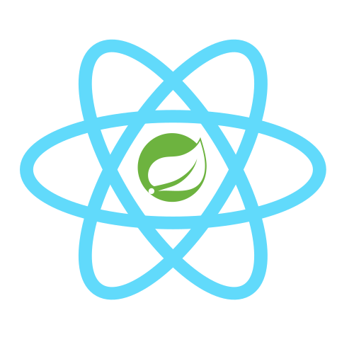

    
    <h1 style="margin-top: -5px"> Spring-Boot-React</h1>
    

    
    
    
    

This project is a skeleton for a React App with Spring Boot on the back-end including JWT authentication and MYSQL.

### Tech Stack
* **React:** React makes it painless to create interactive UIs. Design simple views for each state in your application, and React will efficiently update and render just the right components when your data changes. Declarative views make your code more predictable, simpler to understand, and easier to debug. Build encapsulated components that manage their own state and then compose them to make beautiful UI’s.
* **Material UI:** UI framework that provides React components for faster and easier web development.
* **Java:** The Java Programming Language is a general-purpose, concurrent, strongly typed, class-based object-oriented language. It is normally compiled to the bytecode instruction set and binary format defined in the Java Virtual Machine Specification.
* **Spring Boot:** Spring Boot is an open source Java-based framework used to create a micro Service. It is developed by Pivotal Team and is used to build stand-alone and production ready spring applications.
* **MYSQL:** MySQL is an open-source relational database management system.
* **SQL:** SQL is a domain-specific language used in programming and designed for managing data held in a relational database management system, or for stream processing in a relational data stream management system

## Currently in development

## Main Features